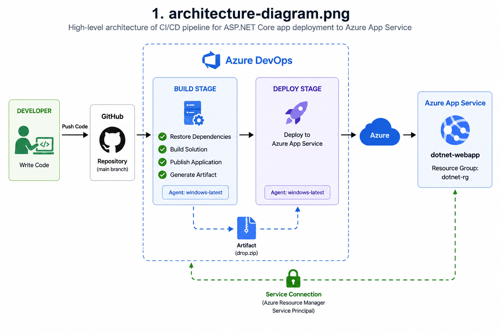
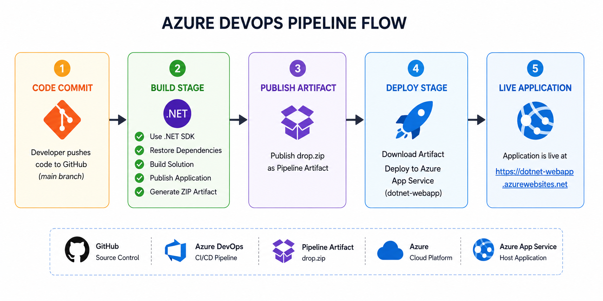

# .NET Application CI/CD Deployment using Azure DevOps & Azure App Service

An end-to-end CI/CD implementation for an ASP.NET Core web application using Azure DevOps YAML pipelines and Azure App Service.

This project automates:

✔ Build process  
✔ Package generation  
✔ Artifact publishing  
✔ Continuous Deployment  
✔ Azure App Service deployment  

---

# Project Architecture



---

# Pipeline Flow



---

# Project Workflow

Developer
↓
GitHub Repository
↓
Azure DevOps YAML Pipeline
↓
Restore Dependencies
↓
Build Application
↓
Publish Artifact
↓
Deploy Stage
↓
Azure App Service
↓
Live Application

---

# Tech Stack

| Category | Technology |
|-----------|-------------|
| Frontend | ASP.NET Core |
| Source Control | GitHub |
| CI/CD | Azure DevOps YAML |
| Cloud Platform | Microsoft Azure |
| Hosting | Azure App Service |
| Build Agent | windows-latest |
| Authentication | Service Connection |

---

# Azure Resources

Resource Group:

```text
dotnet-rg
```

App Service:

```text
dotnet-webapp
```

Runtime:

```text
.NET v10
```

---

# Repository Structure

```text
dotnet-webapp-cicd/
│
├── src/
│
├── pipelines/
│   └── azure-pipelines.yml
│
├── architecture/
    ├── screenshots
│   ├── architecture-diagram.png
│   └── pipeline-flow.png
│
├── docs/
│   ├── project-overview.md
│   ├── prerequisites.md
│   ├── setup-guide.md
│   ├── troubleshooting.md
│   └── interview-questions.md
│
├── README.md
```

---

# CI/CD Pipeline Stages

## Build Stage

- Install .NET SDK
- Restore Dependencies
- Build Application
- Publish Application
- Generate ZIP Artifact

---

## Deploy Stage

- Download Artifact
- Connect using Service Connection
- Deploy to Azure App Service

---

# YAML Pipeline

```yaml
trigger:
- main

pool:
  vmImage: 'windows-latest'

variables:
  buildConfiguration: 'Release'
  azureSubscription: 'dotnet-webapp-connection'
  webAppName: 'dotnet-webapp'
```

---

# Run Locally

Clone repository:

```bash
git clone https://github.com/anilpirla/dotnet-webapp-cicd.git

cd dotnet-webapp-cicd
```

Run application:

```bash
dotnet restore

dotnet build

dotnet run
```

---

# Screenshots

Add screenshots inside:

```text
architecture/screenshots/
```

Examples:

- Build Success
- Deploy Success
- Azure App Service
- Pipeline Success
- Live Application

---

# Common Issues

Issue:

```text
Resource doesn't exist
```

Solution:

- Verify App Service name
- Recreate Service Connection
- Check Azure Subscription

---

# Future Enhancements

- Add Terraform IaC
- Integrate SonarQube
- Add Unit Testing
- Add Docker Support
- Add Kubernetes Deployment

---

# Author

Anil Pirla

GitHub:
https://github.com/anilpirla

---

# License

This project is for educational and portfolio purposes.
